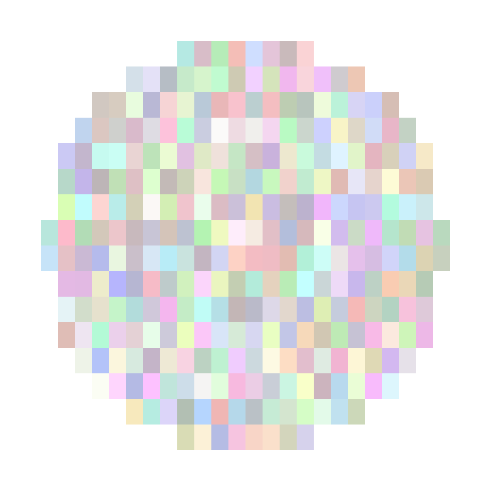
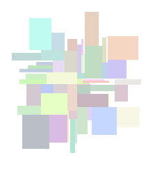
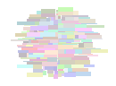
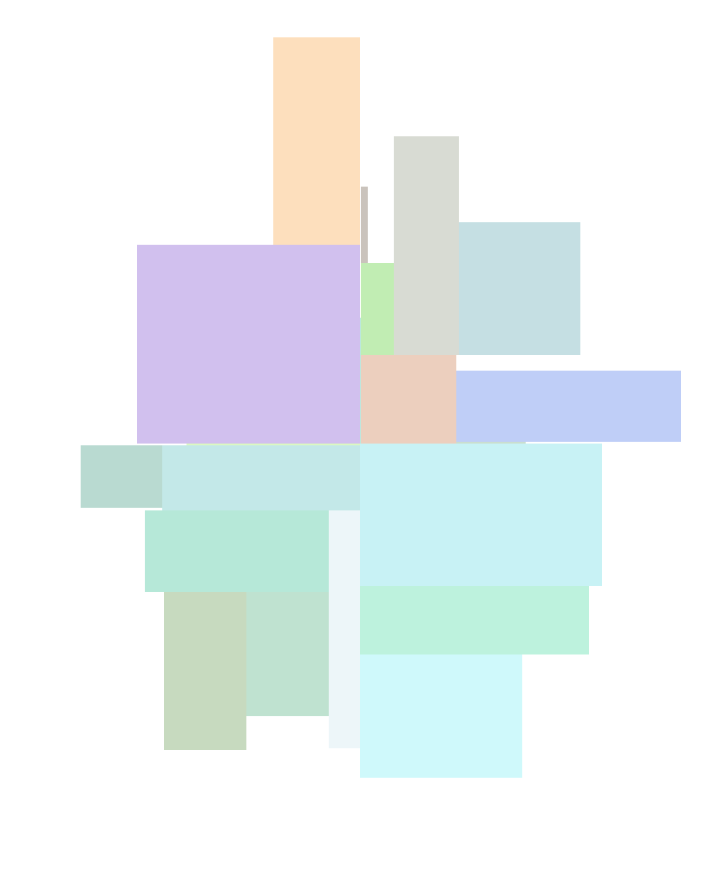

##Идея алгоритма:
Для того, чтобы поместить следующий прямоугольник, выполняем следующие действия:
* Рассматриваем все точки на карте, являющиеся вершинами некоторого прямоугольника.
* Для каждой такой точки - пробуем добавить новый прямоугольник с вершиной в этой точке.
	* Для этого просто за линию пробегаемся по всем прямоугольникам, чтобы убедиться, что размещённый прямоугольник не пересекается с уже установленными.
* Из всех прямоугольников, которые удалось разместить таким образом выбираем ближайший к центру и размещаем его.

##Примеры сгенерированных изображений:

